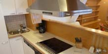
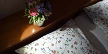
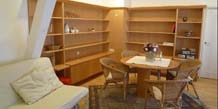
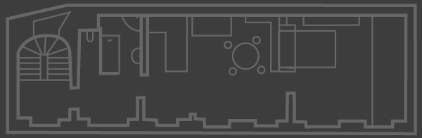

	

		<h1>Apartment A</h1>
		
2nd floor / 80 m2 / up to 3 people

		
You’ll be able to enjoy total peace and quiet in this spacious apartment. A modern, fully equipped Miele kitchen opens out into the living area. The bedroom is separated from the living area and has a comfortable double bed.

		
Amenities include broadband internet with WiFi, cable TV, a sound system and a Nespresso coffee machine.

		
For a fee, you can use the washing machine on the ground floor.

		
<strong><em>Pampered living</em></strong> in an ideal location in the heart of Vienna!

	

	

		
		<figure id="c_appartement_slides">
			<ul id="appartement_slides">
				<li></li>
				<li></li>
				<li></li>
			</ul>
		</figure>
	

	

		
<strong>Hall</strong>
			<ul class="list">
				<li>Cloakroom</li>
				<li>Storage area</li>
			</ul>
		

		
<strong>WC</strong>
			<ul class="list">
				<li>Wash basin</li>
			</ul>
		

		
<strong>Bathroom</strong>
			<ul class="list">
				<li>small bath tub</li>
				<li>Shower</li>
				<li>Washing machine</li>
				<li>Hand towels</li>
				<li>Hairdryer</li>
			</ul>
		

	

	

		
<strong>Kitchen</strong>
			<ul class="list">
				<li>Dishwasher</li>
				<li>Coffee machine</li>
				<li>Kettle</li>
				<li>Toaster</li>
				<li>Refrigerator</li>
				<li>4 Induction hobs</li>
				<li>Oven</li>
				<li>Cooking and eating utensils</li>
				<li>Tea towels</li>
			</ul>
		

		
<strong>Living room</strong>
			<ul class="list">
				<li>Dining area with 4 chairs</li>
				<li>Sofa bed (160x200cm)</li>
				<li>Cable-TV</li>
				<li>Internet</li>
				<li>Radio / CD-Player</li>
				<li>Nespresso coffee machine</li>
				<li>Built-in cupboards</li>
			</ul>
		

	

	

		
<strong>Bedroom</strong>
			<ul class="list">
				<li>Double bed (180x200cm, 2 mattresses)</li>
				<li>Built-in cupboards</li>
				<li>Bed linen</li>
			</ul>
		

		
<strong>Storage room</strong>
			<ul class="list">
				<li>Iron</li>
				<li>Ironing board</li>
			</ul>
		

	

