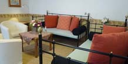
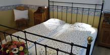

	

		<h1>Apartment B</h1>
		
1st floor / 75 m2 / up to 4 people

		
In this spacious apartment designed in the style of a country home, you’ll be able to enjoy total peace and quiet. Warm colours give this spacious apartment a special flair. The separate dining room can be comfortably used by a family of up to 4 people.

		
WiFi, cable TV and a Nespresso coffee machine are also available for you to use.

		
For a fee, you can use the washing machine on the ground floor.

		
<strong><em>Comfortable living</em></strong> in an ideal location in the heart of Vienna!

	

	

		
		<figure id="c_appartement_slides">
			<ul id="appartement_slides">
				<li></li>
				<li></li>
				<li></li>
			</ul>
		</figure>
	

	
<strong>Kitchen</strong>
		<ul class="list">
			<li>Dishwasher</li>
			<li>Coffee machine</li>
			<li>Kettle</li>
			<li>Toaster</li>
			<li>Refrigerator</li>
			<li>2 ceramic hobs</li>
			<li>Cooking and eating utensils</li>
			<li>Tea towels</li>
		</ul>
	

	
<strong>Bathroom</strong>
		<ul class="list">
			<li>bath tub</li>
			<li>Hand towels</li>
			<li>Hairdryer</li>
		</ul>
	

	
<strong>WC</strong>
		<ul class='list'>
			<li>Shower</li>
		</ul>
	

	
<strong>Living room</strong>
		<ul class='list'>
			<li>2 day beds (90x200cm each)</li>
			<li>Cosy corner seating area</li>
			<li>Shelves</li>
			<li>High-speed WiFi internet</li>
		</ul>
	

	
<strong>Bedroom</strong>
		<ul class='list'>
			<li>Double bed (180x200cm, 2 mattresses)</li>
			<li>Wardrobes</li>
			<li>Bed linen</li>
			<li>Additional bed</li>
		</ul>
	

