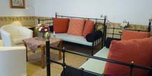
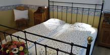
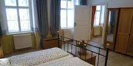
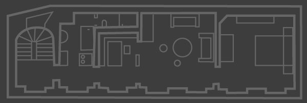

	

		<h1>Appartement B</h1>
		
1. Stock / 75m2 / bis 4 Personen

		
In diesem ger&auml;umigen, im Landhausstil eingerichteten Appartement
		genie&szlig;en Sie absolute Ruhe. Warme Farbt&ouml;ne geben dieser großz&uuml;gigen
		Wohnung ein besonderes Flair. Das separate Esszimmer erm&ouml;glicht auch eine
		bequeme Nutzung für Familien bis 4 Personen.

		
WLAN und Kabel-TV sowie eine Nespresso Kaffee Maschine stehen Ihnen zur Verf&uuml;gung.

		
Gegen eine Geb&uuml;hr k&ouml;nnen Sie die Waschmaschine im Erdgescho&szlig; ben&uuml;tzen.

		
<strong><em>Gem&uuml;tliches Wohnen</em></strong> in idealer Lage im Herzen von Wien!

	

	

		
		<figure id="c_appartement_slides">
			<ul id="appartement_slides">
				<li></li>
				<li></li>
				<li></li>
			</ul>
		</figure>
	

	
<strong>Küche</strong>
		<ul class='list'>
			<li>Geschirrsp&uuml;ler</li>
			<li>Kaffeemaschine</li>
			<li>Wasserkocher</li>
			<li>Toaster</li>
			<li>K&uuml;hlschrank</li>
			<li>2 Ceran-Kochfelder</li>
			<li>Koch- und Essgeschirr</li>
			<li>Geschirrt&uuml;cher</li>
		</ul>
	

	
<strong>Badezimmer</strong>
		<ul class='list'>
			<li>Badewanne</li>
			<li>Handt&uuml;cher</li>
			<li>F&ouml;hn</li>
		</ul>
	

	
<strong>WC</strong>
		<ul class='list'>
			<li>Dusche</li>
		</ul>
	

	
<strong>Wohnzimmer</strong>
		<ul class='list'>
			<li>2 Tagesbetten (jeweils 90x200cm)</li>
			<li>gem&uuml;tliche Sitzecke</li>
			<li>Regal</li>
			<li>Highspeed WLAN Internet</li>
		</ul>
	

	
<strong>Schlafzimmer</strong>
		<ul class='list'>
			<li>Doppelbett (180x200cm, 2 Matratzen)</li>
			<li>Kleiderschr&auml;nke</li>
			<li>Bettw&auml;sche</li>
			<li>Zusatzbett</li>
		</ul>
	

